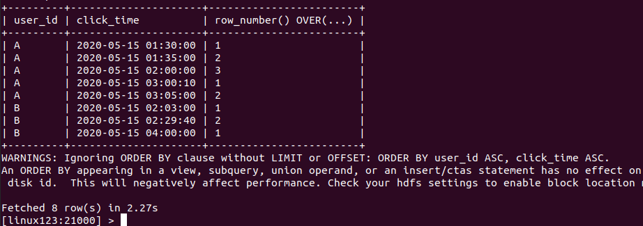

题目：根据需求统计指标


## 一、需求

### （1）业务背景

现有收集到用户的页面点击行为日志数据，数据格式如下：

用户id, 点击时间

```txt
user_id click_time
A,2020-05-15 01:30:00
A,2020-05-15 01:35:00
A,2020-05-15 02:00:00
A,2020-05-15 03:00:10
A,2020-05-15 03:05:00
B,2020-05-15 02:03:00
B,2020-05-15 02:29:40
B,2020-05-15 04:00:00
```

业务：

会话概念：用户的一次会话含义是指用户进入系统开始到用户离开算作一次会话，离开或者重新开始一次会话的概念是指用户的两次行为事件差值大于30分钟，

比如以A用户为例：

第一次会话

```txt
A,2020-05-15 01:30:00
A,2020-05-15 01:35:00
A,2020-05-15 02:00:00

```

第二次会话

```txt
A,2020-05-15 03:00:10
A,2020-05-15 03:05:00
```

判断条件是只要两次时间差值大于30分钟就属于两次会话。

### （2）需求

输入：
```text
A,2020-05-15 01:30:00
A,2020-05-15 01:35:00
A,2020-05-15 02:00:00
A,2020-05-15 03:00:10
A,2020-05-15 03:05:00
B,2020-05-15 02:03:00
B,2020-05-15 02:29:40
B,2020-05-15 04:00:00
```

输出：

对用户的日志数据打上会话内序号，如下
```text
A,2020-05-15 01:30:00,1
A,2020-05-15 01:35:00,2
A,2020-05-15 02:00:00,3
A,2020-05-15 03:00:10,1
A,2020-05-15 03:05:00,2
B,2020-05-15 02:03:00,1
B,2020-05-15 02:29:40,2
B,2020-05-15 04:00:00,1
```


## 二、实现


### （1）加载数据

在 `Hive` 中完成数据加载

```sql
--创建表
drop table if exists user_clicklog;
create table user_clicklog ( 
        user_id string, 
        click_time string
        )
row format delimited fields terminated by ",";

--加载数据
load data local inpath '/root/impala_data/clicklog.dat' into table user_clicklog; 
```


### （2）思路

> 需要：分组和打标（`row_number()`）
> 难点： 同一组中再次分组，再打标。

1. 求出当前时间和上一次时间
2. 求出这次和上次的时间差
3. 标识是否超出 30 分钟 (1：超出， 0：未超出)
4. 窗口里求和 （逐渐递增） , 记为 `flag`
5. 以 `user_id` 和 `flag` 为键，以此分组


### （3）实现步骤

```sql
-- 1. 求得上一个时间
SELECT user_id, click_time, 
       lag(click_time) over(partition by user_id order by click_time) pre_click_time
FROM user_clicklog;


-- 2. 求两个时间差
WITH tmp AS (
SELECT user_id, click_time, 
       lag(click_time) over(partition by user_id order by click_time) pre_click_time
FROM user_clicklog
ORDER BY user_id, click_time
)
SELECT user_id, click_time, pre_click_time, unix_timestamp(click_time) - unix_timestamp(pre_click_time)
FROM tmp;


-- 结果如下：
user_id	click_time	pre_click_time	_c3
A	2020-05-15 01:30:00	NULL	NULL
A	2020-05-15 01:35:00	2020-05-15 01:30:00	300
A	2020-05-15 02:00:00	2020-05-15 01:35:00	1500
A	2020-05-15 03:00:10	2020-05-15 02:00:00	3610
A	2020-05-15 03:05:00	2020-05-15 03:00:10	290
B	2020-05-15 02:03:00	NULL	NULL
B	2020-05-15 02:29:40	2020-05-15 02:03:00	1600
B	2020-05-15 04:00:00	2020-05-15 02:29:40	5420


-- 3. 标识是否超 30 分钟
WITH tmp AS (
SELECT t.user_id, t.click_time, t.pre_click_time, unix_timestamp(t.click_time) - unix_timestamp(t.pre_click_time) diff
FROM (
        SELECT user_id, click_time, 
               lag(click_time) over(partition by user_id order by click_time) pre_click_time
        FROM user_clicklog
        ORDER BY user_id, click_time
    ) t
)
SELECT user_id, click_time, IF(diff >= 1800, 1, 0) status
FROM tmp; 

-- 结果如下：
 	user_id	click_time	status
1	A	2020-05-15 01:30:00	0
2	A	2020-05-15 01:35:00	0
3	A	2020-05-15 02:00:00	0
4	A	2020-05-15 03:00:10	1
5	A	2020-05-15 03:05:00	0
6	B	2020-05-15 02:03:00	0
7	B	2020-05-15 02:29:40	0
8	B	2020-05-15 04:00:00	1


-- 4. 求和分组
WITH tmp AS (
SELECT t2.user_id, t2.click_time, IF(diff >= 1800, 1, 0) status
FROM (
       SELECT t1.user_id, t1.click_time, t1.pre_click_time, unix_timestamp(t1.click_time) - unix_timestamp(t1.pre_click_time) diff
       FROM (
               SELECT user_id, click_time, 
                      lag(click_time) over(partition by user_id order by click_time) pre_click_time
               FROM user_clicklog
               ORDER BY user_id, click_time
           ) t1
       ) t2
)
SELECT user_id, click_time, SUM(status) over(partition by user_id order by click_time) flag
FROM tmp;

-- 结果如下：
 	user_id	click_time	flag
1	A	2020-05-15 01:30:00	0
2	A	2020-05-15 01:35:00	0
3	A	2020-05-15 02:00:00	0
4	A	2020-05-15 03:00:10	1
5	A	2020-05-15 03:05:00	1
6	B	2020-05-15 02:03:00	0
7	B	2020-05-15 02:29:40	0
8	B	2020-05-15 04:00:00	1


-- 5. 按照 user_id 和 sum 分组，求得结果
-- flag 表示：连续求和
WITH tmp AS (
SELECT t3.user_id, t3.click_time, SUM(t3.status) over(partition by t3.user_id order by t3.click_time) flag
FROM (
      SELECT t2.user_id, t2.click_time, IF(diff >= 1800, 1, 0) status
      FROM (
             SELECT t1.user_id, t1.click_time, t1.pre_click_time, unix_timestamp(t1.click_time) - unix_timestamp(t1.pre_click_time) diff
             FROM (
                     SELECT user_id, click_time, 
                            lag(click_time) over(partition by user_id order by click_time) pre_click_time
                     FROM user_clicklog
                     ORDER BY user_id, click_time
                 ) t1
             ) t2
     ) t3
)
SELECT user_id, click_time, row_number() over(partition by CONCAT(user_id, CAST(flag as string)) order by click_time)
FROM tmp;

-- 结果如下：
+---------+---------------------+------------------------+
| user_id | click_time          | row_number() OVER(...) |
+---------+---------------------+------------------------+
| A       | 2020-05-15 01:30:00 | 1                      |
| A       | 2020-05-15 01:35:00 | 2                      |
| A       | 2020-05-15 02:00:00 | 3                      |
| A       | 2020-05-15 03:00:10 | 1                      |
| A       | 2020-05-15 03:05:00 | 2                      |
| B       | 2020-05-15 02:03:00 | 1                      |
| B       | 2020-05-15 02:29:40 | 2                      |
| B       | 2020-05-15 04:00:00 | 1                      |
+---------+---------------------+------------------------+
```

结果截图如下：




